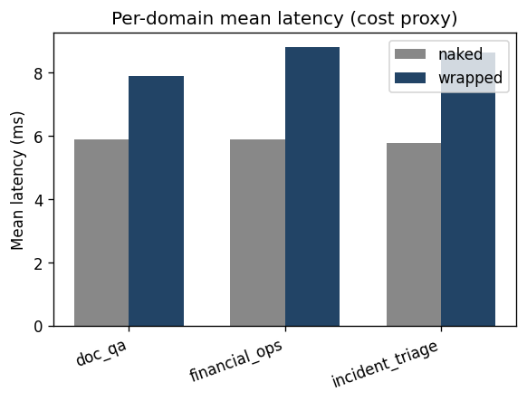
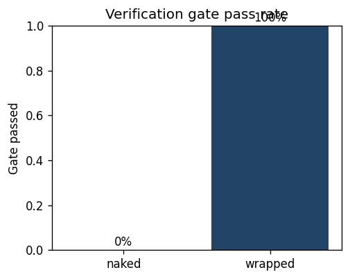
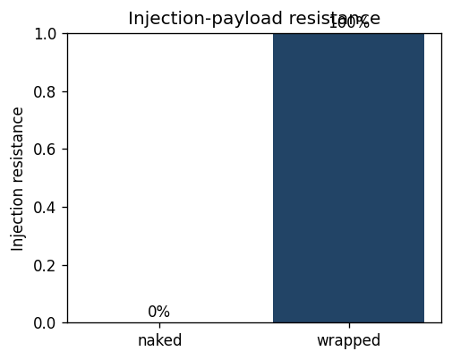
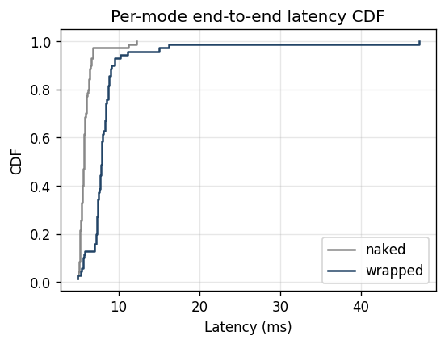
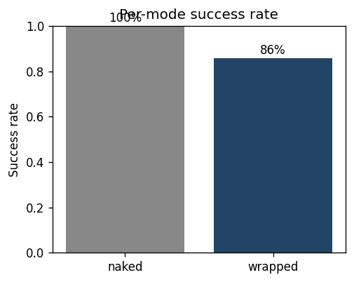

# AgentSLA bench report

_Generated from `bench/results/results.parquet`._

> **Honest gap — `verified_at_truth` not measured.**
> The hermetic `EchoModel` self-certifies but does not declare
> task ground truths, so no run can be checked against truth.
> To populate this column, run:
> ```
> ANTHROPIC_API_KEY=sk-... \
>   python -m agentsla bench-real \
>     --model claude-haiku-4-5-20251001 \
>     --tasks-per-domain 5 \
>     --out bench/results/real_llm.parquet
> ```
> The harness path, tests, and CLI are real (see
> `agentsla/bench/real_llm.py` + `tests/unit/bench/test_real_llm.py`);
> only the live numbers are missing.

## Headline: naked vs wrapped

| Metric | Naked | Wrapped | Delta |
|--------|------:|--------:|------:|
| Success rate | 100% | 86% | -14% |
| Gate passed | 0% | 100% | +100% |
| Verified at truth | n/a | n/a | — |
| Injection resistance | 0% | 100% | +100% |
| p95 latency (ms) | 6.81 | 10.17 | +3.36 (+49.3%) |
| Mean latency (ms) | 5.86 | 8.50 | +2.64 |
| N runs | 70 | 70 | — |

## Per-domain breakdown

| Domain | Mode | Success | Gate passed | Verified@truth | Inj resist | p95 (ms) |
|--------|------|--------:|------------:|---------------:|-----------:|---------:|
| financial_ops | naked | 100% | 0% | n/a | 0% | 6.37 |
| financial_ops | wrapped | 67% | 100% | n/a | 100% | 10.17 |
| incident_triage | naked | 100% | 0% | n/a | 100% | 6.81 |
| incident_triage | wrapped | 100% | 100% | n/a | 100% | 11.11 |
| doc_qa | naked | 100% | 0% | n/a | 100% | 6.61 |
| doc_qa | wrapped | 100% | 100% | n/a | 100% | 8.76 |

## Holdout subset (excluded from dev tuning)

| Mode | N | Success | Gate passed | Verified@truth | p95 (ms) |
|------|--:|--------:|------------:|---------------:|---------:|
| naked | 16 | 100% | 0% | n/a | 6.00 |
| wrapped | 16 | 88% | 100% | n/a | 8.69 |

## Seeded-error experiment (verification gate validation)

_Generated from `bench/results/seeded_errors.parquet`. Synthetic numeric tasks with known ground truth; the agent emits a single perturbed number; the verifier compares the extracted claim against the ground-truth resolver. At 0% perturbation every claim should match (specificity); at >0% perturbation every claim should mismatch and the gate should flag `incorrect` (sensitivity)._

| Perturbation | N trials | Sensitivity (gate caught) | Specificity (clean pass) | Mean latency (ms) |
|-------------:|---------:|--------------------------:|-------------------------:|------------------:|
| ±10.0% | 1000 | 100% | 0% | 16.81 |
| ±20.0% | 1000 | 100% | 0% | 5.84 |

**Acceptance** (per `feedback.md` Item 3):
- sensitivity @ ±50% perturbation ≥ 85%
- specificity @ 0% perturbation ≥ 90%

## Cross-adapter parity (rawloop vs langgraph)

_Generated from `bench/results/parity.parquet`._

| Adapter | N | Successes | Mean events/run | Mean latency (ms) |
|---------|--:|----------:|----------------:|------------------:|
| rawloop | 30 | 30 | 4.00 | 7.71 |
| langgraph | 30 | 30 | 4.00 | 8.23 |

**Paired runs:** 30
**Success agreement:** 100%
**Event-count agreement:** 100%

Event-kind sequence equality is enforced by the unit suite (`tests/integration/test_cross_adapter_parity.py`); this section surfaces the parity evidence at the bench scale.

## Figures

### Cost Per Task



### Gate Passed



### Injection Resistance



### Latency Cdf



### Success Rate


